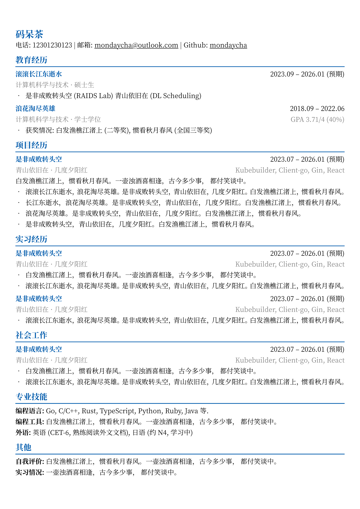

# Typst CV Chinese Template

这是一个适用于 [typst.app](https://typst.app) 的简历模板。Fork 自 [迟先生的简历模板](https://github.com/skyzh/chicv/blob/master/cv.typ)。

## 如何使用

### 快速开始

在 [typst.app](https://typst.app) 创建一个项目，复制粘贴 https://github.com/MondayCha/chinese-cv/blob/master/cv.typ 中的所有内容，完成！

### 字体安装

此模板使用 Noto Serif SC 字体，请前往 [Noto Serif Simplified Chinese](https://fonts.google.com/noto/specimen/Noto+Serif+SC) 下载。

### 修改主题颜色

替换代码中的 `fill: rgb(0, 91, 172)` 片段。

## 演示

### 示例简历

## TODOList

- [ ] 添加图标
